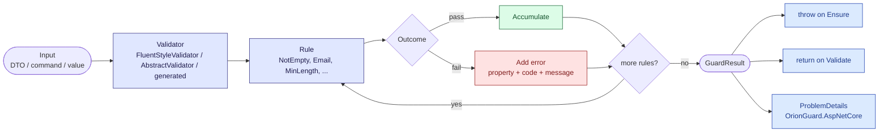

<p align="center">
 

</p>

<h1 align="center">OrionGuard</h1>

<p align="center">
  The most comprehensive guard clause &amp; validation ecosystem for .NET
</p>

<p align="center">
  <a href="https://www.nuget.org/packages/OrionGuard"></a>
  <a href="https://www.nuget.org/packages/OrionGuard"></a>
  <a href="https://github.com/tunahanaliozturk/OrionGuard/blob/master/src/Moongazing.OrionGuard/docs/LICENSE.txt"></a>
  
</p>

---

> Guards, object validation, and DDD primitives in one core package, with integrations for ASP.NET Core, MediatR, MassTransit, Blazor, gRPC, SignalR, Hangfire, EF Core and OpenTelemetry — plus source generators, a transactional outbox, and validation messages in 14 languages.
> [See what's new in the CHANGELOG.](CHANGELOG.md) · [What's coming next (12-month roadmap)](docs/ROADMAP.md)

---

## How it works

OrionGuard's validation pipeline is the same regardless of where it runs (ASP.NET Core filter, MediatR behavior, manual call). Input arrives, a validator runs each rule against each targeted property, the rule outcomes collapse into a `GuardResult`, and the result is either thrown as an exception, returned as a result object, or converted to RFC 9457 ProblemDetails by the AspNetCore package.



In an ASP.NET Core minimal-API endpoint the same pipeline is wrapped by the OrionGuard endpoint filter, which intercepts the request before the handler runs and short-circuits with a ProblemDetails payload when validation fails. The default status code is 422, set by `OrionGuardAspNetCoreOptions.DefaultStatusCode`; a validator that returns `GuardResult.FailureWithStatus(...)` overrides it for that response.

```mermaid
sequenceDiagram
    autonumber
    actor C as Client
    participant API as ASP.NET Core<br/>minimal API
    participant Filt as OrionGuardEndpointFilter
    participant Val as IValidator&lt;T&gt;
    participant Hnd as Handler
    participant PD as ProblemDetails

    C->>API: POST /api/users (JSON body)
    API->>API: model binding -> CreateUserRequest
    API->>Filt: invoke filter chain
    Filt->>Val: Validate(request)
    Val-->>Filt: GuardResult
    alt valid
        Filt->>Hnd: continue
        Hnd-->>API: response
        API-->>C: 2xx OK
    else invalid
        Filt->>PD: build ValidationProblem (errors dictionary)
        PD-->>Filt: status = options.DefaultStatusCode (defaults to 422)
        Filt-->>API: short-circuit (Results.Problem)
        API-->>C: 422 (default) application/problem+json
    end
```

---

## Why OrionGuard?

| Feature | OrionGuard | FluentValidation | Ardalis.GuardClauses | Dawn.Guard |
|---------|:----------:|:----------------:|:--------------------:|:----------:|
| Fluent guard clauses | Yes | - | Yes | Yes |
| Object validation | Yes | Yes | - | - |
| ASP.NET Core middleware | Yes | Yes | - | - |
| Minimal API filters | Yes | Yes | - | - |
| MediatR pipeline | Yes | Yes | - | - |
| Source generators | Yes | - | - | - |
| Blazor integration | Yes | Yes | - | - |
| gRPC interceptor | Yes | - | - | - |
| SignalR hub filter | Yes | - | - | - |
| OpenTelemetry | Yes | - | - | - |
| Injection heuristics (SQL/XSS) | Yes | - | - | - |
| Dynamic JSON rules | Yes | - | - | - |
| Span-based (zero alloc) | Yes | - | - | - |
| 14 languages | Yes | 20+ | - | - |
| NativeAOT ready | Yes | - | - | - |
| Polymorphic validation | Yes | Yes | - | - |
| Deep nested validation | Yes | Yes | - | - |
| Validation caching | Yes | - | - | - |
| Domain events + outbox | Yes | - | - | - |

---

## Quick Start (30 seconds)

```bash
dotnet add package OrionGuard
```

```csharp
using Moongazing.OrionGuard.Core;
using Moongazing.OrionGuard.Extensions;

// Guard clauses — throw on invalid
Ensure.That(email).NotNull().NotEmpty().Email();
Ensure.That(age).InRange(18, 120);

// High-performance — zero allocation
FastGuard.NotNullOrEmpty(name, nameof(name));
FastGuard.Email(email, nameof(email));

// Heuristic screening for obvious payloads; not a substitute for parameterized
// queries and output encoding (see Security Guards below)
userInput.AgainstSqlInjection(nameof(userInput));
userInput.AgainstXss(nameof(userInput));

// Collect all errors — don't throw
var result = GuardResult.Combine(
    Ensure.Accumulate(email, "Email").NotNull().Email().ToResult(),
    Ensure.Accumulate(password, "Password").MinLength(8).ToResult()
);
if (result.IsInvalid)
    return BadRequest(result.ToErrorDictionary());
```

---

## Ecosystem Packages

Every package below ships from this repository. Install the core package plus whichever integrations you actually use; each one links to its own README on nuget.org.

| Package | Install | Purpose |
|---------|---------|---------|
| [`OrionGuard`](https://www.nuget.org/packages/OrionGuard) | `dotnet add package OrionGuard` | Guards, object validation, and the DDD primitives everything else builds on |
| [`OrionGuard.AspNetCore`](https://www.nuget.org/packages/OrionGuard.AspNetCore) | `dotnet add package OrionGuard.AspNetCore` | RFC 9457 ProblemDetails, Minimal API and MVC filters, options validation, health check |
| [`OrionGuard.MediatR`](https://www.nuget.org/packages/OrionGuard.MediatR) | `dotnet add package OrionGuard.MediatR` | Validates a MediatR request or stream before its handler, plus a MediatR event dispatcher |
| [`OrionGuard.MassTransit`](https://www.nuget.org/packages/OrionGuard.MassTransit) | `dotnet add package OrionGuard.MassTransit` | Consume filter that faults an invalid message before the consumer sees it |
| [`OrionGuard.Blazor`](https://www.nuget.org/packages/OrionGuard.Blazor) | `dotnet add package OrionGuard.Blazor` | `EditForm` validation components for server-hosted Blazor |
| [`OrionGuard.Grpc`](https://www.nuget.org/packages/OrionGuard.Grpc) | `dotnet add package OrionGuard.Grpc` | Server interceptor that rejects an invalid message with `InvalidArgument` |
| [`OrionGuard.SignalR`](https://www.nuget.org/packages/OrionGuard.SignalR) | `dotnet add package OrionGuard.SignalR` | Hub filter that validates hub method arguments |
| [`OrionGuard.Hangfire`](https://www.nuget.org/packages/OrionGuard.Hangfire) | `dotnet add package OrionGuard.Hangfire` | Rejects an invalid background job at enqueue time, not on a worker |
| [`OrionGuard.Swagger`](https://www.nuget.org/packages/OrionGuard.Swagger) | `dotnet add package OrionGuard.Swagger` | Writes OrionGuard attribute constraints into Swashbuckle schemas |
| [`OrionGuard.OpenApi`](https://www.nuget.org/packages/OrionGuard.OpenApi) | `dotnet add package OrionGuard.OpenApi` | Generates a validator from an OpenAPI 3 schema at build time |
| [`OrionGuard.SchemaExport`](https://www.nuget.org/packages/OrionGuard.SchemaExport) | `dotnet add package OrionGuard.SchemaExport` | Exports a model's attribute rules as JSON Schema or a TypeScript interface |
| [`OrionGuard.Generators`](https://www.nuget.org/packages/OrionGuard.Generators) | `dotnet add package OrionGuard.Generators` | `[GenerateValidator]` compile-time validators, no reflection |
| [`OrionGuard.OpenTelemetry`](https://www.nuget.org/packages/OrionGuard.OpenTelemetry) | `dotnet add package OrionGuard.OpenTelemetry` | Metrics and spans for validation and domain-event dispatch |
| [`OrionGuard.Aspire`](https://www.nuget.org/packages/OrionGuard.Aspire) | `dotnet add package OrionGuard.Aspire` | One call to put every OrionGuard meter, activity source and health check into an Aspire app |
| [`OrionGuard.EntityFrameworkCore`](https://www.nuget.org/packages/OrionGuard.EntityFrameworkCore) | `dotnet add package OrionGuard.EntityFrameworkCore` | Dispatches domain events on `SaveChanges`, inline or through a transactional outbox |
| [`OrionGuard.Outbox.Dashboard`](https://www.nuget.org/packages/OrionGuard.Outbox.Dashboard) | `dotnet add package OrionGuard.Outbox.Dashboard` | Authorized JSON endpoints to list, replay and discard failed outbox rows |
| [`OrionGuard.Outbox.PostgresNotify`](https://www.nuget.org/packages/OrionGuard.Outbox.PostgresNotify) | `dotnet add package OrionGuard.Outbox.PostgresNotify` | Wakes the outbox dispatcher on PostgreSQL `LISTEN`/`NOTIFY` instead of polling |
| [`OrionGuard.Outbox.SqlServerBroker`](https://www.nuget.org/packages/OrionGuard.Outbox.SqlServerBroker) | `dotnet add package OrionGuard.Outbox.SqlServerBroker` | Wakes the outbox dispatcher on SQL Server Service Broker instead of polling |
| [`OrionGuard.Locks.Redis`](https://www.nuget.org/packages/OrionGuard.Locks.Redis) | `dotnet add package OrionGuard.Locks.Redis` | Redis lease for the outbox `IDistributedLock`, instead of a lock table |
| [`OrionGuard.Testing`](https://www.nuget.org/packages/OrionGuard.Testing) | `dotnet add package OrionGuard.Testing` | Domain-event capture, an in-memory dispatcher, and runner-agnostic assertions |
| [`OrionGuard.Migration`](https://www.nuget.org/packages/OrionGuard.Migration) | `dotnet tool install OrionGuard.Migration` | dotnet tool that rewrites FluentValidation validators onto OrionGuard |
| [`OrionGuard.Templates`](https://www.nuget.org/packages/OrionGuard.Templates) | `dotnet new install OrionGuard.Templates` | `dotnet new` templates: `orionguard-webapi`, `orionguard-outbox` |

---

## Core Features

### Fluent API

```csharp
// Automatic parameter name capture via CallerArgumentExpression
Ensure.That(email).NotNull().NotEmpty().Email();
Ensure.That(password).NotNull().MinLength(8);

// Transform and default
var cleaned = Ensure.That(rawEmail)
    .Transform(e => e.Trim().ToLowerInvariant())
    .Default("unknown@example.com")
    .Email()
    .Value;

// Conditional validation
Ensure.That(age)
    .When(requireAge).InRange(18, 120)
    .Unless(isAdmin).Positive()
    .Always().NotZero();
```

### Security Guards

The injection guards are **heuristics, not a defence**. They are denylists: they turn away input that
contains a known attack token, they miss payloads written in forms they do not list, and they reject some
ordinary text. Use them to reject obviously hostile input early and to flag it in logs. The protection
always belongs at the sink:

| Risk | Heuristic guard | Actual defence |
|---|---|---|
| SQL injection | `AgainstSqlInjection` | Parameterized queries (ADO.NET parameters, EF Core, Dapper) |
| XSS | `AgainstXss` | Contextual output encoding (Razor/Blazor encode by default), Content-Security-Policy, an HTML sanitizer for markup |
| Command injection | `AgainstCommandInjection` | `ProcessStartInfo.ArgumentList` without a shell, allow-listed arguments |
| LDAP injection | `AgainstLdapInjection` | RFC 4515 escaping for filters, RFC 4514 for DNs |
| XXE | `AgainstXxe` | `XmlReaderSettings { DtdProcessing = Prohibit, XmlResolver = null }` |

```csharp
userInput.AgainstSqlInjection(nameof(userInput));      // Heuristic: SQL keywords, comments, tautologies
userInput.AgainstXss(nameof(userInput));                // Heuristic: script tags, event handlers, js: URLs
command.AgainstCommandInjection(nameof(command));       // Heuristic: shell metacharacters, leading '-'
userInput.AgainstInjection(nameof(userInput));          // Heuristic: the checks above, tuned for free text
```

The path and redirect guards decide from the structure of the value instead:

```csharp
fileName.AgainstPathTraversal(nameof(fileName));        // Rejects "..", rooted/UNC paths, encoded variants
var fullPath = fileName.AgainstPathEscape(uploadRoot, nameof(fileName)); // Resolved path, inside uploadRoot
returnUrl.AgainstOpenRedirect(nameof(returnUrl), "example.com");        // Local path or allow-listed host
```

### International Guards (NEW in v6.0)

```csharp
"DEUTDEFF".AgainstInvalidSwiftCode(nameof(swift));     // SWIFT/BIC
"978-3-16-148410-0".AgainstInvalidIsbn(nameof(isbn));  // ISBN-10/13
"1HGCM82633A004352".AgainstInvalidVin(nameof(vin));    // Vehicle ID
"4006381333931".AgainstInvalidEan(nameof(ean));         // EAN-13
"DE123456789".AgainstInvalidVatNumber(nameof(vat));     // EU VAT
"490154203237518".AgainstInvalidImei(nameof(imei));     // IMEI
```

### Deep Nested Validation (NEW in v6.0)

```csharp
var result = Validate.Nested(order)
    .Property(o => o.OrderNumber, p => p.NotEmpty())
    .Property(o => o.Total, p => p.GreaterThan(0))
    .Nested(o => o.Customer, customer => customer
        .Property(c => c.Name, p => p.NotEmpty().Length(2, 100))
        .Property(c => c.Email, p => p.NotEmpty().Email())
        .Nested(c => c.Address, address => address
            .Property(a => a.City, p => p.NotEmpty())
            .Property(a => a.ZipCode, p => p.NotEmpty().Length(5, 10))))
    .Collection(o => o.Items, (item, index) => item
        .Property(i => i.ProductName, p => p.NotEmpty())
        .Property(i => i.Quantity, p => p.GreaterThan(0)))
    .ToResult();
// Errors: "Customer.Address.City", "Items[2].ProductName", etc.
```

### Cross-Property Validation (NEW in v6.0)

```csharp
var result = Validate.CrossProperties(booking)
    .IsGreaterThan(b => b.EndDate, b => b.StartDate, "End date must be after start date")
    .AreNotEqual(b => b.Email, b => b.Username)
    .AtLeastOneRequired(b => b.Phone, b => b.Email)
    .When(b => b.IsInternational, v => v
        .Must(b => !string.IsNullOrEmpty(b.PassportNumber), "PassportNumber", "Passport required for international bookings"))
    .ToResult();
```

### Polymorphic Validation (NEW in v6.0)

```csharp
var validator = Validate.Polymorphic<Payment>()
    .When<CreditCardPayment>(p => Validate.Nested(p)
        .Property(x => x.CardNumber, v => v.NotEmpty().Length(16, 16))
        .Property(x => x.Cvv, v => v.NotEmpty().Length(3, 4))
        .ToResult())
    .When<BankTransferPayment>(p => Validate.Nested(p)
        .Property(x => x.Iban, v => v.NotEmpty())
        .ToResult())
    .Otherwise(p => GuardResult.Failure("Payment", "Unknown payment type."));

var result = validator.Validate(payment);
```

### Dynamic Rule Engine (NEW in v6.0)

```csharp
// Load rules from JSON (e.g., from database, config file, API)
var json = """
{
  "Name": "CreateUser",
  "Rules": [
    { "PropertyName": "Email", "RuleType": "NotEmpty" },
    { "PropertyName": "Email", "RuleType": "Email" },
    { "PropertyName": "Age", "RuleType": "Range", "Parameters": { "Min": 18, "Max": 120 } },
    { "PropertyName": "Country", "RuleType": "In", "Parameters": { "Values": ["US", "UK", "TR"] } },
    { "PropertyName": "Password", "RuleType": "MinLength", "Parameters": { "Min": 8 },
      "WhenProperty": "IsNewUser", "WhenValue": true }
  ]
}
""";

var validator = DynamicValidator.FromJson(json);
var result = validator.Validate(userDto);
```

### DDD Primitives (NEW in v6.1)

> **Deprecated in v6.4.0.** The `[StronglyTypedId]` source generator is superseded by the standalone [OrionKey](https://github.com/tunahanaliozturk/OrionKey) package (`[OrionId]`). It still works through the v6.x line and is removed in v7.0.0. See [the migration guide](docs/migrations/stronglytypedid-to-orionkey.md). The manual `StronglyTypedId<TValue>` record is not affected.

```csharp
// Hybrid ValueObject — abstract class or record-based marker
public sealed class Money : ValueObject
{
    public decimal Amount { get; }
    public string Currency { get; }

    public Money(decimal amount, string currency)
    {
        Ensure.That(amount).NotNegative();
        Amount = amount; Currency = currency;
    }

    protected override IEnumerable<object?> GetEqualityComponents()
    {
        yield return Amount; yield return Currency;
    }
}

// Record-based value object — structural equality from the compiler
public sealed record Address(string Street, string City, string PostalCode) : IValueObject;

// Strongly-typed id via source generator (EF Core + JSON + TypeConverter all auto-generated)
[StronglyTypedId<Guid>]
public readonly partial struct OrderId;

// Aggregate root with domain events and invariant enforcement
public sealed class Order : AggregateRoot<OrderId>
{
    public Order(OrderId id) : base(id)
    {
        id.AgainstDefaultStronglyTypedId(nameof(id));
    }

    public void Ship()
    {
        CheckRule(new OrderMustBePaidRule(this));
        RaiseEvent(new OrderShippedEvent(Id));
    }
}

// Wire up DI (registers all generated EF Core converters in the calling assembly)
services.AddOrionGuardStronglyTypedIds();
```

> **v6.2 update:** `IStronglyTypedId<TValue>` marker interface unifies source-gen struct ids and manual record ids under one guard. `DomainEventBase` record spares you the `EventId`/`OccurredOnUtc` boilerplate. Generated ids implement `IParsable<TSelf>` / `ISpanParsable<TSelf>` for ASP.NET Core minimal API binding. EF Core converter emission is now conditional on the consumer referencing EF Core. Sub-package NuGet IDs dropped the `Moongazing.` prefix — install as `OrionGuard.AspNetCore`, `OrionGuard.Blazor`, etc. (C# namespaces unchanged).
>
> Domain events ship as `IDomainEventDispatcher`, the MediatR bridge and the EF Core `SaveChanges` interceptor. The `BusinessRule` base class, `Guard.Against.BrokenRule` and the ASP.NET Core ProblemDetails integration ship alongside them.

---

### RuleSets (NEW in v6.0)

```csharp
public class UserValidator : AbstractValidator<User>
{
    public UserValidator()
    {
        RuleFor(u => u.Email, "Email", p => p.NotEmpty().Email());

        RuleSet("create", () =>
        {
            RuleFor(u => u.Password, "Password", p => p.NotEmpty().Length(8, 100));
        });

        RuleSet("update", () =>
        {
            RuleFor(u => u.Id, "Id", p => p.NotNull());
        });
    }
}

// Execute selectively
validator.Validate(user, RuleSet.Default, RuleSet.Create);
validator.Validate(user, RuleSet.Update);
```

### Async Validation (NEW in v6.6)

Rules that need I/O, such as a uniqueness check against a database or a remote lookup,
join the same pipeline as the synchronous rules and are awaited together. The cancellation
token flows through, and the async terminal is idempotent: awaiting the result more than
once returns the same errors and runs each async rule only once.

```csharp
var result = await Validate.For(input)
    .Property(u => u.Email, g => g.NotNull().Email())
    .Property(u => u.Password, g => g.NotNull().MinLength(8))
    .MustAsync(u => u.Email, IsEmailAvailableAsync, "Email is already registered.", "EMAIL_TAKEN")
    .ToResultAsync(cancellationToken);

// Or throw on the first failure, awaiting the I/O rules:
var validated = await Validate.For(input)
    .MustAsync(u => u.Email, IsEmailAvailableAsync, "Email is already registered.")
    .ThrowIfInvalidAsync(cancellationToken);
```

Synchronous and asynchronous rules can be mixed freely. Once a validator has any `MustAsync`
rule registered, finish it with an async terminal (`ToResultAsync`, `BuildAsync`, or
`ThrowIfInvalidAsync`); the synchronous `ToResult()` / `Build()` terminals throw
`InvalidOperationException` rather than silently skipping the pending async rules. Validators
with no async rules keep using the synchronous `Validate(...)` and `ToResult()` paths unchanged.

---

## ASP.NET Core Integration

```bash
dotnet add package OrionGuard.AspNetCore
```

```csharp
// Program.cs
builder.Services.AddOrionGuardAspNetCore();

// Minimal API with automatic validation
app.MapPost("/api/users", (CreateUserRequest req) => { ... })
   .WithValidation<CreateUserRequest>();

// IOptions validation
builder.Services.AddOptions<AppSettings>()
    .BindConfiguration("App")
    .ValidateWithOrionGuardOnStart();

// Health check
builder.Services.AddHealthChecks().AddOrionGuardCheck();

// MVC controller with attribute
[ValidateRequest]
public IActionResult Create([FromBody] CreateUserRequest request) { ... }
```

---

## MediatR Integration

```bash
dotnet add package OrionGuard.MediatR
```

```csharp
builder.Services.AddOrionGuardMediatR(typeof(Program).Assembly);

// Any IValidator<TRequest> is automatically executed before the handler
public class CreateUserValidator : AbstractValidator<CreateUserCommand>
{
    public CreateUserValidator()
    {
        RuleFor(x => x.Email, "Email", p => p.NotEmpty().Email());
    }
}
```

---

## Source Generator (NativeAOT)

```bash
dotnet add package OrionGuard.Generators
```

```csharp
[GenerateValidator]
public sealed class CreateUserRequest
{
    [NotNull, NotEmpty, Length(3, 50)]
    public string Name { get; set; }

    [NotNull, Email]
    public string Email { get; set; }

    [Range(13, 120)]
    public int Age { get; set; }
}

// Auto-generated at compile time — no reflection!
var result = CreateUserRequestValidator.Validate(request);
```

---

## Blazor Integration

```bash
dotnet add package OrionGuard.Blazor
```

```razor
<EditForm Model="@user" OnValidSubmit="HandleSubmit">
    <OrionGuardValidator />
    <InputText @bind-Value="user.Name" />
    <ValidationMessage For="() => user.Name" />
</EditForm>
```

---

## gRPC & SignalR

```csharp
// gRPC — automatic protobuf message validation
services.AddOrionGuardGrpc();
services.AddGrpc(o => o.Interceptors.Add<OrionGuardInterceptor>());

// SignalR — automatic hub method parameter validation
services.AddOrionGuardSignalR();
```

---

## Hangfire

Validate a background job's arguments at enqueue time. An invalid job is rejected by the
`Enqueue`/`Schedule` call with a structured `JobArgumentValidationException`, instead of being
persisted and failing later inside a worker. Arguments with no registered validator pass through.

```csharp
// Register your validators in DI, then wire the client filter to the same provider.
builder.Services.AddOrionGuard();
builder.Services.AddValidator<SendEmailArgs, SendEmailArgsValidator>();

var app = builder.Build();

GlobalConfiguration.Configuration
    .UseInMemoryStorage()
    .UseOrionGuardValidation(app.Services);
// or: GlobalJobFilters.Filters.AddOrionGuardClientFilter(app.Services);

// Throws JobArgumentValidationException at the call site; the job is never persisted.
BackgroundJob.Enqueue<IEmailSender>(s => s.Send(new SendEmailArgs("not-an-email", "")));
```

---

## Localization (14 Languages)

English, Turkish, German, French, Spanish, Portuguese, Arabic, Japanese, Italian, Chinese, Korean, Russian, Dutch, Polish

```csharp
ValidationMessages.SetCulture("zh");
var msg = ValidationMessages.Get("NotNull", "Email");
// Output: "Email 不能为空。"
```

---

## Performance

- **GeneratedRegex** — All 24 regex patterns are source-generated. Zero runtime compilation.
- **FastGuard** — Span-based zero-allocation validation with `[MethodImpl(AggressiveInlining)]`
- **FrozenSet** — O(1) lookups for security patterns (SQL, XSS, path traversal)
- **ThrowHelper** — `[DoesNotReturn]` + `[StackTraceHidden]` for minimal JIT footprint
- **Validation Caching** — Cache results with TTL for identical inputs
- **NativeAOT** — Source generator enables reflection-free validation
- **AOT story for domain events:** `ServiceProviderDomainEventDispatcher` and `OutboxDispatcherHostedService` use runtime reflection; they are marked with `[RequiresUnreferencedCode]` and `[RequiresDynamicCode]`. Two AOT-friendly paths exist: (1) use the **MediatR bridge** (`MediatRDomainEventDispatcher`) which has no reflection, or (2) root your event/handler types via `[DynamicDependency]` and use System.Text.Json source generation for outbox payloads. The core guard / validation surface remains fully AOT-safe.

---

## Benchmarks

See [benchmarks.md](benchmarks.md) for the full BenchmarkDotNet run, environment, fairness rules and per-scenario interpretation. OrionGuard vs **FluentValidation 12.1.1**, same rules and same inputs, .NET 10, BenchmarkDotNet 0.15.8 `--job short`, Intel Core Ultra 7 255H:

| Scenario | FluentValidation | OrionGuard | |
|----------|------------------|------------|---|
| 5-rule DTO, valid | 178 ns / 632 B | 112 ns / 64 B (`AbstractValidator`), 65 ns / 96 B (`[GenerateValidator]`) | OrionGuard 1.6x - 2.8x |
| 5-rule DTO, all 5 rules failing | 3,131 ns / 9,656 B | 326 ns / 1,040 B | OrionGuard 9.6x (FluentValidation formats messages, OrionGuard interpolates) |
| Same DTO via inline `Validate.For` | 178 ns / 632 B | 1,584 ns / 3,832 B | **FluentValidation 8.9x** |
| Nested object + 10-item collection | 3.3 us / 9.5 KB | 1,083 us / 119 KB (`Validate.Nested`) | **FluentValidation 335x** |
| Fail fast on the first error | 480 ns (`CascadeMode.Stop`, returns) | 1,905 ns (`ForStrict`, throws) | **FluentValidation 4.0x** |
| Construct validator + validate once | 2,697 ns / 11.3 KB | 539 ns (`AbstractValidator`), 1,900 ns (`FluentStyleValidator`) | OrionGuard 1.4x - 5.0x |
| One async rule, valid | 381 ns / 704 B | 159 ns / 232 B | OrionGuard 2.4x |

The two OrionGuard losses are expression-tree costs, not design trade-offs, and are itemized in [benchmarks.md](benchmarks.md#what-this-comparison-says-about-orionguard). Reproduce with `dotnet run -c Release --project benchmarks/Moongazing.OrionGuard.Benchmarks` (add `-- --filter '*Comparison*' --job short` for the comparison suite only).

---

## FluentValidation Migration

OrionGuard provides a compatibility layer for easy migration:

```csharp
// Change: using FluentValidation;
// To:     using Moongazing.OrionGuard.Compatibility;

public class UserValidator : FluentStyleValidator<User>
{
    public UserValidator()
    {
        RuleFor(x => x.Name).NotEmpty().MaximumLength(100);
        RuleFor(x => x.Email).NotEmpty().EmailAddress();
        RuleFor(x => x.Age).InclusiveBetween(18, 120);
    }
}
```

---

## Custom Exception Types

`Guard` and `Ensure` throw `GuardException` or one of its subclasses (`NullValueException`, `OutOfRangeException`, ...); most extension guards throw `ArgumentException`. To surface your own exception types, translate at your boundary:

```csharp
try
{
    Guard.AgainstNull(order, nameof(order));
}
catch (GuardException ex)
{
    throw new MyCustomException(ex.ErrorCode, ex.ParameterName, ex.Message);
}
```

`IExceptionFactory` is never called by the guards. It, `AddOrionGuardExceptionFactory<T>()`, `ExceptionFactoryProvider` and `DefaultExceptionFactory` are obsolete and will be removed in v7.

---

## Roadmap

OrionGuard publishes a public, twelve-month forward roadmap covering the next minor releases
through **v7.0.0 (Q2 2027)**. See [docs/ROADMAP.md](docs/ROADMAP.md) for the next-12-months
view (v6.5.0 family integration, v6.6.0 asynchronous validation, v6.7.0 production excellence,
v7.0.0 API freeze) plus the deep tier backlog of every item under consideration.

If something on the roadmap matters to you, open an issue with the `roadmap` label. Real
workload demand is what moves items up the list.

---

## More from the Orion family

OrionGuard is the flagship of a set of focused, standalone .NET libraries that share a quality bar. The v6 `[StronglyTypedId]` generator graduated into the standalone OrionKey package; OrionGuard keeps its own `IDistributedLock` primitive and bridges to standalone OrionLock backends via `OrionGuard.Locks.Redis`:

- [OrionAudit](https://github.com/tunahanaliozturk/OrionAudit) - automatic EF Core change-audit trail.
- [OrionKey](https://github.com/tunahanaliozturk/OrionKey) - source-generated strongly-typed IDs.
- [OrionLock](https://github.com/tunahanaliozturk/OrionLock) - distributed locks with fencing tokens.
- [OrionPatch](https://github.com/tunahanaliozturk/OrionPatch) - transactional outbox for EF Core.
- [OrionGrant](https://github.com/tunahanaliozturk/OrionGrant) - permission / policy authorization.
- [OrionLedger](https://github.com/tunahanaliozturk/OrionLedger) - API-key issuance, verification, rotation.
- [OrionBeacon](https://github.com/tunahanaliozturk/OrionBeacon) - leader election.
- [OrionRelay](https://github.com/tunahanaliozturk/OrionRelay) - outbound webhook delivery.
- [OrionSaga](https://github.com/tunahanaliozturk/OrionSaga) - sagas / process managers.
- [OrionStream](https://github.com/tunahanaliozturk/OrionStream) - server-sent events / streaming hub.
- [OrionVault](https://github.com/tunahanaliozturk/OrionVault) - field-level encryption for EF Core.
- [OrionOnce](https://github.com/tunahanaliozturk/OrionOnce) - HTTP idempotency keys.
- [OrionShade](https://github.com/tunahanaliozturk/OrionShade) - sensitive-data redaction.
- [OrionClock](https://github.com/tunahanaliozturk/OrionClock) - testable time, TTLs, deadlines.
- [OrionResult](https://github.com/tunahanaliozturk/OrionResult) - Result/Option types.
- [OrionLens](https://github.com/tunahanaliozturk/OrionLens) - ambient correlation context.
- [Orion.Abstractions](https://github.com/tunahanaliozturk/Orion.Abstractions) - the shared contracts spine.

---

### See it in a real app

[Moongazing.OrionShowcase](https://github.com/tunahanaliozturk/OrionShowcase) is a production-shaped banking sample integrating the Orion family end-to-end. OrionGuard does the most work in the showcase: every command validator is a `FluentStyleValidator<TCommand>`, Domain guards use `Ensure`/`FastGuard`/`Contract`, and `AddOrionGuardAspNetCore` + `UseOrionGuardValidation` handle ProblemDetails. Concrete usage in the showcase:

- [src/Moongazing.OrionShowcase.Application/Accounts/Commands/TransferMoney/TransferMoneyValidator.cs](https://github.com/tunahanaliozturk/OrionShowcase/blob/main/src/Moongazing.OrionShowcase.Application/Accounts/Commands/TransferMoney/TransferMoneyValidator.cs)
- [src/Moongazing.OrionShowcase.Domain/Accounts/Account.cs](https://github.com/tunahanaliozturk/OrionShowcase/blob/main/src/Moongazing.OrionShowcase.Domain/Accounts/Account.cs)
- [src/Moongazing.OrionShowcase.Api/Program.cs](https://github.com/tunahanaliozturk/OrionShowcase/blob/main/src/Moongazing.OrionShowcase.Api/Program.cs)

---

## Contributing

Issues and pull requests welcome. Please read [CONTRIBUTING.md](CONTRIBUTING.md) and the [Code of Conduct](CODE_OF_CONDUCT.md) before opening one.

## License

This project is licensed under the [MIT License](src/Moongazing.OrionGuard/docs/LICENSE.txt).

## Author

**Tunahan Ali Ozturk** - [GitHub](https://github.com/tunahanaliozturk)
